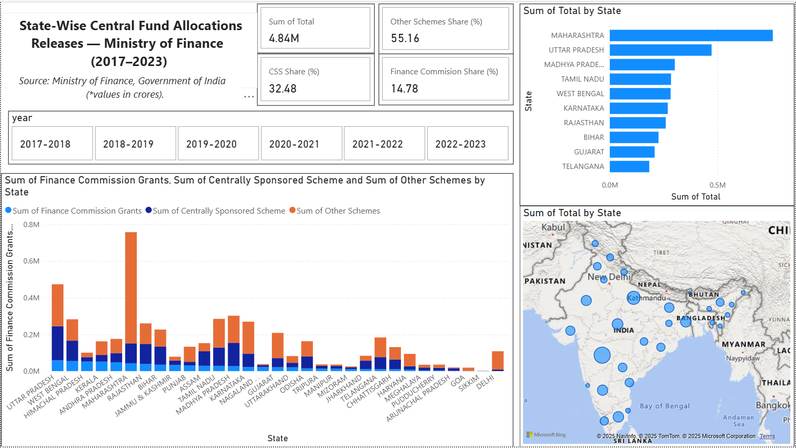

# State-Wise Central Fund Allocation & Utilization Analysis (2017-2023)

## Overview
This project analyzes multi-year **state-wise central government allocations** in India under:
- **Finance Commission Grants**
- **Centrally Sponsored Schemes (CSS)**
- **Other Schemes**
  
An interactive **Power BI dashboard** was created to visualize geographic distribution, scheme composition, and funding trends across states.

---

## Project Structure

```
📦 state-finance
├── README.md
├── powerbi
  ├── statefin.pbix
├── processed data
  ├── statefin.xlsx
├── raw data
  ├── statefin.pdf
```
©generated by [GitTree](https://github.com/sachinz25/GitTree)

---

## Data Source

- **Ministry of Finance, Government of India**
 ```
UNSTARRED QUESTION NO. 999 in RAJYA SABHA
TO BE ANSWERED ON TUESDAY 26th July, 2022  
“Allocation of funds in devolution schemes of Finance Commission and GST”

-ANSWER by
THE MINISTER OF STATE IN THE MINISTRY OF FINANCE 
(SHRI PANKAJ CHAUDHARY)
 ```
[Official pdf link](https://sansad.in/getFile/annex/257/AU999.pdf?source=pqars) 

---

## Preview



---
